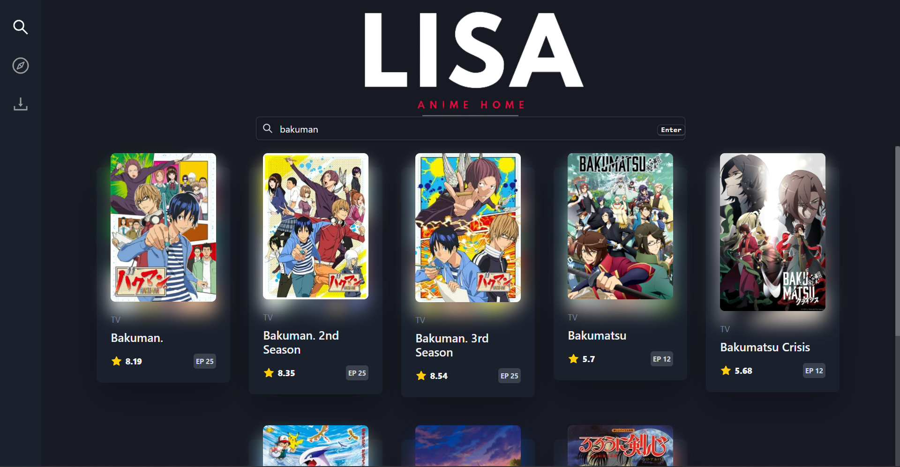
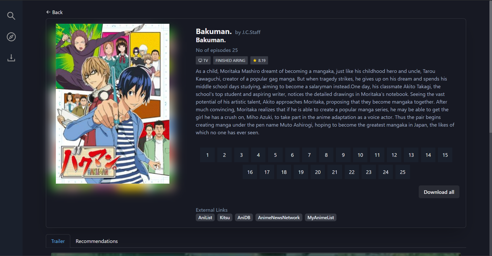
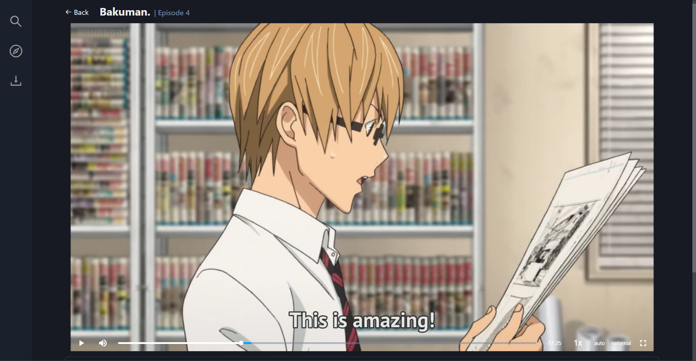
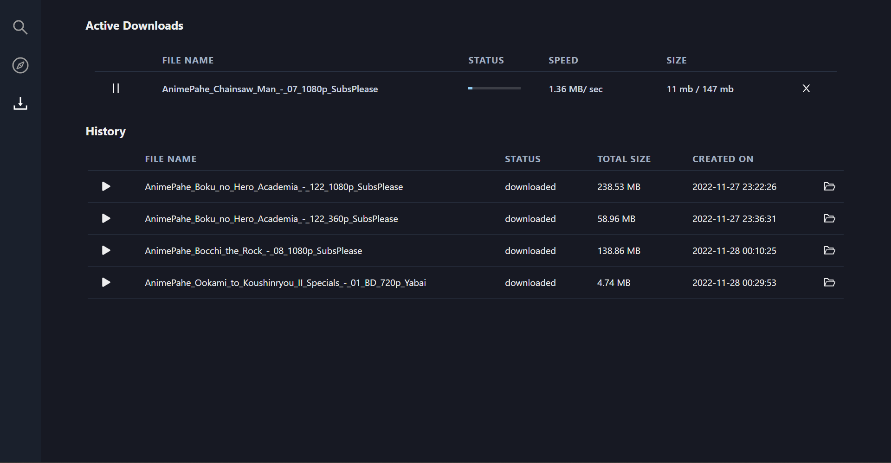
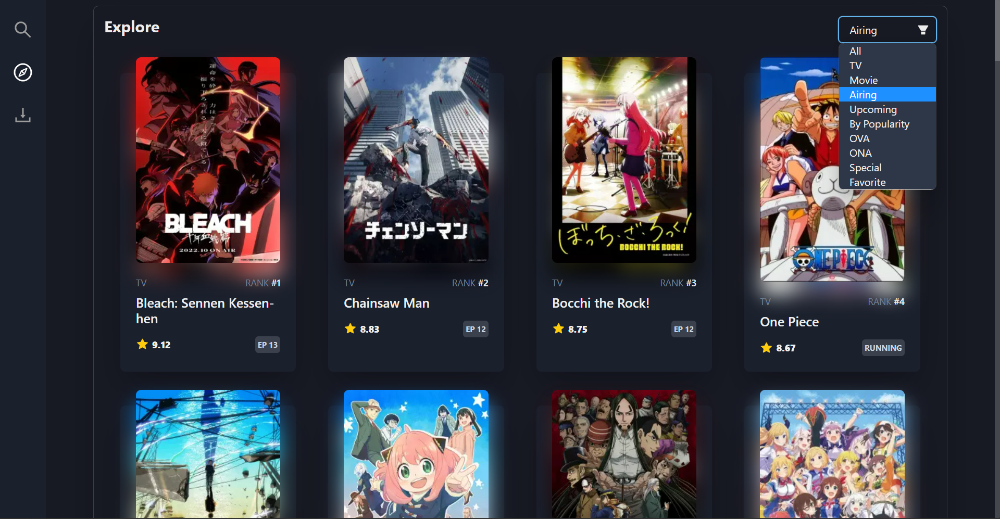

<div align="center">


[](https://github.com/Cosmicoppai/LiSA/network)
[](https://github.com/Cosmicoppai/LiSA/stargazers)
[](https://github.com/Cosmicoppai/LiSA/issues)
[](./LICENSE)


</div>

A Desktop application, for streaming and downloading your favourite anime.

## ⚠️ Alert

We are adding new features, so the current main branch is unstable. We recommend that you download the stable version from [here](https://github.com/Cosmicoppai/LiSA/releases/tag/v1.0.0).

## CONTENTS OF THE FILE

-   [Features](#-features)
-   [Dependencies](#dependencies)
-   [Download](#-download)
-   [Demo](#-demo)
-   [Future Plans](#future-plans)
-   [FAQ](#-faq)
-   Appendix
    -   [Supported Webistes](#%EF%B8%8F-supported-websites)
    -   [Supported External Video Player](#-supported-external-players)
    -   [Filters](#filters)
-   [Contributing](#-contributing)
    -   [Setup](./CONTRIBUTING.md#-development-setup)
-   [Support](#-support)
-   [License](#-license)
-   [Disclaimer](#disclaimer)

## 🚀 Features

-   A User Friendly Interface
-   Download anime from [supported websites](#-supported-websites) in multiple resolutions and languages
-   Batch Download
-   Stream anime on the inbuilt player and your favourite [external video player](#-supported-external-players)
-   Explore anime based on different [filters](#filters)
-   Download Manager
-   Library to view pre-downloaded episodes and active downloads
-   Recommendation System

<br>

## 🤗 Download

[](https://github.com/Cosmicoppai/LiSA/releases/tag/v1.0.0)

> Note: Currently only windows executables are provided.

Download the [latest release](https://github.com/Cosmicoppai/LiSA/releases/tag/v1.0.0) from here and extract the zip file.

### Tested on

-   Windows 8, 10 & 11.

## 😁 Demo

### Screenshots


_Search results for Bakuman_


_Episode details of Bakuman_


_Built-in Video Player on LiSA_


_Download Manager and Library_


_Explore Page with filters_

https://user-images.githubusercontent.com/66635990/204451842-76fdbbd0-3476-48fd-a1dd-77eff145a432.mp4

## Future Plans

-   UI Improvement
-   Watchlist
-   Continue Watching
-   Download episodes with custom range

## 🤔 FAQ

### Q) How can I download detective conan's episodes from 10 to 30?

-> Search for the anime with `detective conan`, on the anime page you get **Download all** option, this will start the batch download of all the episodes present on that page.

### Q) Where can I access all the downloaded episodes?

-> You can either view them on the Download page of LiSA , OR Visit `LiSA-win32-x64\resources\downloads\` on windows file explorer.

### Q) Where can I view recommendations, if I liked Kimetsu no Yaiba?

-> Search for the anime, in this case `Kimetsu no Yaiba`, scroll down there you see a tab recommendations.

### Q) How can I switch to the external player?

-> In video player, on the bottom right click on `external`, choose your favourite video player, [currently supported players](#supported-external-players).

### Q) How do I download Episode 8 of Mob Psycho III?

-> Visit the episode, you want to download, select the language, and resolution you want to download in, the downloud will start, the status of which you can check from Download manager.

### Q) Do I have to create any user account to stream or download anime?

-> No, you do not need to sign up for an account to stream, explore or download anime.

## 😶‍🌫️ Supported Websites

Note: In the following version the user can only download from animepahe, more websites to come in future. <br>
| Website | Sub/Dub selection | Supported resolutions | File Size |
|--- |--- |--- |--- |
| [AnimePahe](https://animepahe.com/) | Yes | 720p, 1080p | 720p: ~150MB, 1080p: ~200MB |

## 📺 Supported External Players

### MPV

To install mpv, run the following command from the command line or PowerShell:

```cli
choco install mpv
```

OR

Visit: [Official MPV site](https://mpv.io/installation/)

Make sure mpv is added to Path.<br> <br>

### VLC Media Player

Download and Install VLC Media player form [here](https://www.videolan.org/vlc/download-windows.html).

<br>

## Filters

-   TV
-   Movie
-   Airing
-   Upcoming
-   By Popularity
-   OVA
-   ONA
-   Special
-   Favourite

## 🤝 CONTRIBUTING

Contributions, issues, and feature requests are welcome! See [See Contribution Guide.](./CONTRIBUTING.md)

## ⭐ SUPPORT

If this project is helpful to you and love our work and feels like showing love/appreciation, give a ⭐, AND 😉...

[](https://paypal.me/SayAnime)

## 📄 LICENSE

This project is licensed under the MIT License - see the [LICENSE](https://github.com/Cosmicoppai/LiSA/blob/main/LICENSE) file for details.

## DISCLAIMER

This software has been developed just to improve users experience while streaming and downloading anime. Please support original content creators!
